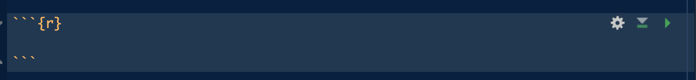

::: callout-note
## How to use this article

This article is designed as an introduction to medical students who are new to coding. 

You can read it as a normal article, or you can copy the code chunks into RStudio and run them step by step.
:::


## 1. Why learn R as a medical student?

R is one of the most widely used programming languages for statistics, data analysis, and data visualisation. For medical students, this is especially valuable because so much of modern medicine depends on interpreting data. For example, clinical trials, systematic reviews, and epidemiology research all rely on statistical thinking.

The biggest advantage of R is reproducibility. In Excel, it is easy to manually delete a row, change a value, or recode a variable without leaving a clear record. This can make the analysis difficult to be checked and repeated. In R, every step can be written as code: importing the data, cleaning variables, removing missing values, running statistical tests, and creating figures. In addition, R is very powerful in custimizing output figures, making them valuable in creating journal level graphs. 

Learning R also helps you become more independent in research. Instead of relying entirely on someone else to analyse your data, you can explore datasets yourself, check whether results make sense, and produce clear tables and visualisations for presentations, posters, and publications.


## 2. What are R and RStudio?

- **R** is the programming language itself. It is the engine that performs calculations, reads data, runs models, and creates plots.
- **RStudio**, is the IDE (integrated development environment) where it gives you a more user-friendly interface to write and run your R code.


## Installing R and RStudio

To start, install both R and RStudio.

1.  Download and install [R](https://cran.rstudio.com/) and
 [RStudio](https://docs.posit.co/ide/user/#rstudio-ide-oss-downloads) from the official websites.
2.  Open RStudio.


When you open RStudio, you will usually see several panels:

| RStudio panel | What it is used for |
|------------------------------------|------------------------------------|
| Source/script panel (Top Left) | Where you write and save your code |
| Console (Bottom Left) | Where code runs and results appear |
| Environment (Top Right) | Where loaded datasets and stored objects appear |
| Files/plots/packages/help (Bottom Right) | Where you view files, plots, packages, and help pages |


## Create QMD File

Quarto document is a special kind of file within RStudio that allows users to render a HTML file to be able to show the results in a better looking way.

After creating the QMD file, we can save the file inside a dedicated project folder.

A sample project folder might look like this:

```text
my_research_project/
├── data_raw/
├── data_cleaned/
├── scripts/
├── figures/
└── results/
```

Following the above structured is a good way to ensure that your datasets and code are well formatted. A good habit is to keep your original dataset in `data_raw/` and never overwrite it. Any cleaned version should be saved separately in `data_cleaned/`.

## Your first R commands

To be able to write and run code in R, first you would need to create a code chunk, which can be created by pressed `Option + Command + I` in Mac or `Ctrl+Alt+I` in Windows. 



You can write your code within the code chunk and click and on green play button on the upper right corner to run your code.

Let us begin with very simple commands. 

```{r}
# addition
2 + 2

# division
10 / 5

# square root
sqrt(25)
```

R can also store values called **objects** by using the `<-` symbol. 

```{r}
# assigning the age object as 24
age <- 24
# assigning the height_cm object as 175
height_cm <- 175
```

The symbol `<-` means “store this value as this name.” In the code above, the value `24` is stored in an object called `age`.

You can then use the object later:

```{r}
# adding 1 to the age object
age + 1
# divide the height_cm object by 100
height_cm / 100
```

Text values need quotation marks to be assigned to objects:

```{r}
# assign the text 'Control' to the object patient group
patient_group <- "Control"
```

You can also store several values together in a **vector**:

```{r}
# creating a vector object age with a vector of number
ages <- c(21, 22, 24, 30, 28)
```

Here, `c()` means “combine.” It creates a vector containing multiple values. We can then apply statistical analysis functions on the vectors, basic functions include `mean()`, `median()`, and `range()`:

```{r}
mean(ages)
median(ages)
range(ages)
```


## Packages: extending what R can do

Base R already does a lot, but many common tasks are easier with packages. A package is like an add-on that gives R extra functions.

For beginner health data analysis, three useful packages are:

- `tidyverse`: a collection of packages for data cleaning, manipulation, and visualisation;
- `readr`: useful for importing rectangular data such as CSV files;
- `janitor`: useful for cleaning column names and creating quick tables.

You install a package once:

```{r}
#| eval: false
install.packages("tidyverse")
install.packages("readr")
install.packages("janitor")
```

Then you load it each time you start a new R session:

```{r}
library(tidyverse)
library(readr)
library(janitor)
```

Once you have installed the packages, you can reuse them in different qmd files by loading them.


## Loading a sample health dataset

For this article, we will use a fictional teaching dataset called `rise_sample_health_data.csv`.

You can place the dataset in a folder called `data/` next to this Quarto file:

```text
article_folder/
├── article_01_getting_started_with_r.qmd
└── data/
    └── rise_sample_health_data.csv
```

The dataset contains fictional participant-level data with the following variables:

| Variable | Description | Variable type |
|------------------------|------------------------|------------------------|
| `participant_id` | Unique participant identifier | Categorical/text |
| `age` | Age in years | Continuous/numeric |
| `sex` | Sex recorded as Male/Female | Categorical |
| `bmi` | Body mass index | Continuous/numeric |
| `systolic_bp` | Systolic blood pressure in mmHg | Continuous/numeric |
| `diastolic_bp` | Diastolic blood pressure in mmHg | Continuous/numeric |
| `hba1c_mmol_mol` | HbA1c in mmol/mol | Continuous/numeric |
| `smoking_status` | Never, Former, or Current | Categorical |
| `exercise_minutes_per_week` | Weekly exercise minutes | Continuous/numeric |
| `diabetes_status` | Diabetes status recorded as Yes/No | Binary categorical |

To load the dataset:

```{r}
library(tidyverse)
library(janitor)

health_data <- read_csv("data/rise_sample_health_data.csv")
```

The object `health_data` now contains the dataset.

## Inspecting the dataset

Before we start our analysis, we need to first inspect our dataset to understand its structure and the variables it contain. 

Start by looking at the first few rows:

```{r}
head(health_data)
```

Check the overall structure:

```{r}
glimpse(health_data)
```

Check the number of rows and columns:


```{r}
nrow(health_data)
ncol(health_data)
dim(health_data)
```

Check the column names:

```{r}
names(health_data)
```

Generate a simple summary:

```{r}
summary(health_data)
```

These commands help you answer basic but important questions:

- How many participants are in the dataset?
- What variables are available?
- Are the variable names clear?
- Are numeric variables being read as numbers?
- Do any values look strange?

## Understanding rows, columns, and variables

Most health research datasets are organized in the following format:

- Each **row** usually represents one participant, patient, sample, hospital admission, or observation.
- Each **column** represents one variable.
- Each **cell** contains one value.

For example, if a dataset has 60 participants and 10 variables, it should usually have 60 rows and 10 columns.

You can think about variables by their type:

| Variable type | Meaning | Examples |
|------------------------|------------------------|------------------------|
| Continuous | Numeric measurement that can take many values | Age, BMI, blood pressure, HbA1c |
| Categorical | Group or label | Sex, smoking status, study group |
| Binary | Two-category variable | Diabetes yes/no, treatment yes/no |
| Ordinal | Ordered category | Mild/moderate/severe, stage 1/2/3 |
| Time-to-event | Time until an outcome occurs | Survival time, time to relapse |


## Creating simple summaries

Once the data are loaded and inspected, you can create simple summaries.

Mean age:

```{r}
mean(health_data$age, na.rm = TRUE)
```

Median BMI:

```{r}
median(health_data$bmi, na.rm = TRUE)
```

Number of participants by sex:

```{r}
health_data %>%
  count(sex)
```

Number of participants by smoking status:

```{r}
health_data %>%
  count(smoking_status)
```

Mean BMI by diabetes status:

```{r}
health_data %>%
  group_by(diabetes_status) %>%
  summarise(
    n = n(),
    mean_bmi = mean(bmi, na.rm = TRUE),
    median_bmi = median(bmi, na.rm = TRUE)
  )
```

Notice the repeated use of `na.rm = TRUE`. This tells R to remove missing values when calculating the summary. If you do not include it and there are missing values, R may return `NA` instead of a number.

## Making a first plot

R can also create figures. The `ggplot2` package, which is included in the tidyverse, is commonly used for data visualisation.

The structure of a ggplot is as follow:
```{r} 
# ggplot(data = dataset_name, aes(x = variable_name, y = variable_name)) + 
#  geom_type_of_plot() + 
#  labs(title = "Plot title", x = "X-axis label", y = "Y-axis label" ) 
```

You can think of a ggplot as being built in layers:

`ggplot()` starts the plot.
`data = dataset_name` tells R which dataset to use.
`aes()` means “aesthetic mapping”. This tells R which variables should go on the x-axis and y-axis.
`geom_*()` tells R what type of graph to draw, such as a histogram, scatterplot, boxplot, or bar chart.
`labs()` adds clear labels, including the title and axis names.


A histogram of BMI:

```{r}
ggplot(health_data, aes(x = bmi)) +
  geom_histogram(binwidth = 2, colour = "white") +
  labs(
    title = "Distribution of BMI",
    x = "BMI",
    y = "Number of participants"
  )
```

A boxplot of BMI by diabetes status:

```{r}
ggplot(health_data, aes(x = diabetes_status, y = bmi)) +
  geom_boxplot() +
  labs(
    title = "BMI by diabetes status",
    x = "Diabetes status",
    y = "BMI"
  )
```

At this stage, do not worry about making the plots perfect. The first goal is to make a plot appear and understand what it is showing.

## The basic research data workflow

A simple research data workflow looks like this:

1.  Define the research question.
2.  Import the dataset.
3.  Inspect the dataset.
4.  Clean the data.
5.  Summarise the data.
6.  Visualise the data.
7.  Choose an appropriate statistical test.
8.  Interpret the result.
9.  Report the finding clearly.

The early steps matter more than beginners often realise. If the dataset is messy or misunderstood, a statistical test will not rescue the analysis.

A good first question is not “Which test should I run?” It is “What does each row and column actually represent?”

## Common beginner mistakes

### Forgetting quotation marks around file names

Incorrect:

```text
read_csv(data/rise_sample_health_data.csv)
```

Correct:

```{r}
read_csv("data/rise_sample_health_data.csv")
```

File paths are text, so they need quotation marks.

### Using the wrong working directory

If R cannot find your file, it may be looking in the wrong folder. One solution is to use an RStudio Project and keep your data folder inside the project.

You can check your current working directory with:

```{r}
getwd()
```

### Confusing uppercase and lowercase

R is case-sensitive. These are different objects:

```text
Health_Data
health_data
HEALTH_DATA
```

Choose simple lowercase names and use them consistently.

### Forgetting to load packages

If `read_csv()` does not work, you may not have loaded the package that contains it.

```{r}
library(readr)
```

Or load the tidyverse:

```{r}
library(tidyverse)
```

### Editing raw data manually

Avoid manually changing the original spreadsheet without documentation. If you change data by hand, it becomes harder to explain what was changed and why.

A better approach is:

- keep the raw dataset untouched;
- write cleaning steps in R code;
- save a cleaned dataset separately.

## Mini activity: load and inspect your first dataset

Download the sample dataset and try the following activity.

### Task

1.  Open RStudio.
2.  Create a new R script.
3.  Load the tidyverse and janitor packages.
4.  Import `rise_sample_health_data.csv`.
5.  View the first few rows.
6.  Count the number of rows and columns.
7.  Identify which variables are continuous and which are categorical.
8.  Write down one possible research question using the dataset.

### Starter code

```{r}
library(tidyverse)
library(janitor)

health_data <- read_csv("data/rise_sample_health_data.csv")

head(health_data)
glimpse(health_data)
summary(health_data)

nrow(health_data)
ncol(health_data)
names(health_data)
```

### Reflection questions

- What does each row represent?
- Which variables are numerical?
- Which variables are categorical?
- Are there any values that look strange?
- What research questions could you ask using this dataset?

## What comes next?

Loading the dataset is only the beginning. Real research datasets are often messy: missing values, inconsistent labels, duplicate rows, impossible values, and unclear column names are all common.

In the next article, we will use a messier version of this same sample dataset and walk through how to clean it step by step.

::: callout-tip
## Key takeaway

R is not just a statistics calculator. It is a way to make your research workflow clearer, safer, and more reproducible. Start small: load the data, inspect it, and understand what each row and column means.
:::

## Appendix
### Beginner glossary

| Term | Meaning |
|------------------------------------|------------------------------------|
| Object | Something stored in R, such as a number, word, vector, or dataset |
| Function | A command that performs an action, such as `mean()` or `summary()` |
| Argument | Information you give to a function |
| Vector | A sequence of values, such as several ages |
| Dataframe | A table-like object, similar to a spreadsheet |
| Package | An add-on that gives R extra functions |


## Downloadable resources

- [`RISE_Sample_Health_Data.csv`](data/rise_sample_health_data.csv)
- [`R scripts used to create this article`](scripts/article_01_starter_code.R)

