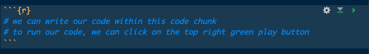

::: callout-note
## How to use this article

This article is written for medical students who are completely new to R. The goal is to help you understand the basic structure of R code and how it can be used for simple medical data analysis.

You can read this article like a normal guide, but you will learn much more by opening RStudio and running the code yourself. Try to run each code chunk line by line, pause after each step, and check what has changed in your data.

The original code and datasets used in this article are available on [GitHub](https://github.com/Ziyao-Geng/RISE-Data-Science-Articles), so you can download them and practice on the same files.
:::


## 1. Why learn R as a medical student? 

As a medical student, you may not think of yourself as someone who needs to code. However, if you are interested in research, you will eventually need to work with data. 

R is one of the most widely used programming languages for statistics, data analysis, and data visualisation. It can help you summarise patterns, explore relationships between variables, run statistical tests, and create clear figures for presentations, posters, and papers. One of the biggest advantages of R is **reproducibility**. In a spreadsheet, it is easy to delete a row, change a value, or edit a formula without leaving a clear record. In R, each step of the analysis can be written as code. This means that other people can later see exactly what was done and repeat the same analysis if needed. 

You do not need to become a professional programmer to benefit from R. Even learning the basics can make you more confident, independent, and prepared for research.


## 2. What are R, RStudio, and Quarto?

Before we start with writing code, it helps to first understand the three related software.

| Tool | What it does |
|-----------------------------------|-----------------------------------|
| **R** | The programming language that performs calculations, reads data, runs statistical analyses, and creates plots. |
| **RStudio** | The integrated development environment (**IDE**) where you write, run, and organise R code. |
| **Quarto** | A document format that combines normal writing, R code, results, tables, and figures in one file. |

This article is written as a Quarto document. That means the code and explanation can be outputted together in the same file.

## 3. Installing R and RStudio

To start, install both R and RStudio.

1.  Download and install R from [CRAN](https://cran.csiro.au/).
2.  Download and install RStudio Desktop from [Posit](https://docs.posit.co/ide/user/#rstudio-ide-oss-downloads).
3.  Open RStudio.

When you open RStudio, you will usually see several panels.

| RStudio panel | What it is used for |
|-----------------------------------|-----------------------------------|
| Source/script panel | Where you write and save code |
| Console | Where code runs and results appear |
| Environment | Where loaded datasets and stored objects appear |
| Files/plots/packages/help | Where you view files, plots, packages, and help pages |


{fig-align="center"}

Do not worry if the layout feels unfamiliar at first. RStudio looks busy because it is trying to show you your code, your results, your files, and your plots all at once. It becomes much less intimidating after we get familiar with it.


## 4. Create a simple project folder

Before analysing data, create a dedicated folder for your project. Good file organisation is key to help you organize your workflow and make sure your code is easy to understand and reproduce.

For this first article, we will use a simple folder structure as below:

``` text
article_01_getting_started_with_r/
├── article_01_getting_started_with_r.qmd
├── data/
│   └── rise_sample_health_data.csv
├── scripts/
│   └── article_01_starter_code.R
└── outputs/
```

::: callout-tip
## Beginner habit

Keep the dataset in a `data/` folder and keep your R code in a script or Quarto file. This makes your project easier to reopen later.
:::

## 5. Your first R commands

In Quarto, R code is written inside code chunks. In RStudio, you can insert a code chunk using:

- Mac: `Option + Command + I`
- Windows: `Ctrl + Alt + I`

You can run a code chunk by clicking the green play button in the top-right corner of the chunk.

{fig-align="center"}


Let us begin with simple calculations.

```{r}
# Addition
2 + 2

# Division
10 / 5

# Square root
sqrt(25)
```

R can also store values as **objects**. An object is a named item that R remembers.

```{r}
# Store a single number as an object called age.
age <- 24

# Store another number as an object called height_cm.
height_cm <- 175

# Use the objects in calculations.
age + 1
height_cm / 100
```

The assignment symbol `<-` means "store this value as this object".

You can also store text. The only thing different is that text values need quotation marks, whereas numbers do not.

```{r}
# Store text as an object.
patient_group <- "Control"
print(patient_group)
```


## 6. Working with several values

A **vector** is a collection of values. In R, we create vectors using `c()`, which stands for combine.

```{r}
# Create a vector of ages.
ages <- c(21, 22, 24, 30, 28)

# Calculate basic summaries.
mean(ages)
median(ages)
range(ages)
```

## 7. Packages: extending what R can do

Base R can already do many things, but packages add extra functions. In this series, we will mainly use the `tidyverse`.

The `tidyverse` is a collection of R packages that helps with importing data, cleaning data, summarising data, and making plots.

You only need to install a package once on your computer.

```{r}
#| eval: false
# Run this only if tidyverse is not already installed.
install.packages("tidyverse")
```

Every new R session, you need to load the package before using it.

```{r}
# Load tidyverse for this R session.
library(tidyverse)
```

A useful rule:

- `install.packages()` = install once;
- `library()` = load whenever you start a new session.

## 8. Load in your first health dataset

In this article, we will use a fictional teaching dataset called `rise_sample_health_data.csv`.

Each row represents one fictional participant. Each column represents one variable, such as age, BMI, blood pressure, or diabetes status.

```{r}
# Store the file path in one object.
data_path <- "data/rise_sample_health_data.csv"

# Check that the file exists before trying to read it.
if (!file.exists(data_path)) {
  # if the file path does not exist, we would print out this error message to help us double check
  stop("Cannot find the dataset. Check that rise_sample_health_data.csv is inside the data/ folder.")
}

# Import the CSV file.
# show_col_types = FALSE keeps the output cleaner when rendering the article.
health_data <- read_csv(data_path, show_col_types = FALSE)
```

After running this code, you should see `health_data` appear in the Environment panel in RStudio.

## 9. Pipes and pipelines

Before we inspect the dataset, we need to introduce one of the most useful ideas in R: the **pipe**.

The pipe symbol looks like this `%>%`, which we can read as *then*.

A pipe takes the result from the left-hand side and passes it into the next function on the right-hand side.

For example, this code shows the first few rows of `health_data`.

```{r}
# Show the first 6 rows of the dataset.
head(health_data)
```

The same code can be written using a pipe.

```{r}
# Take health_data,
# then show the first 6 rows.
health_data %>%
  head()
```

Both versions do the same thing. The piped version becomes especially useful when we want to perform several steps in order.

Here is a simple example using `select()` to keep only a few columns.

```{r}
# Take health_data,
# then keep only selected columns.
health_data %>%
  select(participant_id, age, sex, bmi)
```

Now we can add another step.

```{r}
# Take health_data,
# then keep selected columns,
# then show only the first 6 rows.
health_data %>%
  select(participant_id, age, sex, bmi) %>%
  head()
```


::: callout-important
## Important beginner point

The most useful part of pipeline is that it allows the code to be written in a step-by-step style, which is much easier for interpretation.

The pipe does not automatically save the result. If you want to keep the output, you need to assign it to a new object using `<-`. This is useful because it allows us to create a smaller or cleaner version of the dataset without changing the original `health_data` object.

```{r}
# Create a smaller dataset and save it as health_data_small.
health_data_small <- health_data %>%
  select(participant_id, age, sex, bmi)

health_data_small
```

:::


## 10. Inspect the dataset

Before doing any analysis, always start by looking at the dataset.

```{r}
# Show the first 6 rows.
head(health_data)
```

```{r}
# Show the structure of the dataset.
glimpse(health_data)
```

```{r}
# Count rows and columns.
nrow(health_data)
ncol(health_data)
dim(health_data)
```

```{r}
# Show column names.
names(health_data)
```

```{r}
# Produce simple summaries.
summary(health_data)
```

These commands answer basic questions:

- How many rows are there?
- How many columns are there?
- What variables are present?
- Which variables are numeric?
- Which variables are categorical?
- Do any values look obviously strange?

## 11. Understand rows, columns, and variables

In most clinical research datasets:

- each **row** represents one participant, patient, admission, sample, or observation;
- each **column** represents one variable;
- each **cell** contains one value.

Common variable types include:

| Variable type | Meaning               | Examples                           |
|---------------|-----------------------|------------------------------------|
| Continuous    | Numeric measurement   | Age, BMI, blood pressure           |
| Categorical   | Group or label        | Sex, smoking status, hospital site |
| Binary        | Two-category variable | Diabetes yes/no                    |
| Ordinal       | Ordered category      | Mild/moderate/severe               |

Knowing the variable type helps us decide which summaries, plots, and statistical tests we need to use later.

## 12. Create very simple summaries

Let us create a few basic summaries. To apply a calculation or summary on a specific column of data within the total dataset, we would use the `$` symbol:

```{r}
# Mean age.
# Some participants may have missing age values. 
# na.rm = TRUE means "remove NA values before doing any calculations".
mean(health_data$age, na.rm = TRUE)

# Median BMI.
median(health_data$bmi, na.rm = TRUE)

# Range of systolic blood pressure.
range(health_data$systolic_bp, na.rm = TRUE)
```


For categorical variables, we can count the number of rows in each category.

```{r}
# Count participants by sex.
health_data %>%
  count(sex)
```

```{r}
# Count participants by diabetes status.
health_data %>%
  count(diabetes_status)
```

This article stops at very simple summaries. More formal descriptive statistics and Table 1-style outputs will be covered in Article 3.

## 13. Make your first plots

Plots are very useful in helping us understand the shape of the data before running statistical tests.

Before making specific plots, it is useful to understand the basic structure of `ggplot`.

Most `ggplot` code follows this general pattern:

```r
# Basic structure of a ggplot
ggplot(data = dataset_name, aes(x = variable_name, y = variable_name)) +
  geom_type_of_plot() +
  labs(
    title = "Plot title",
    x = "Label for x-axis",
    y = "Label for y-axis"
  ) +
  theme_minimal()
```

There are three main parts:

1. `ggplot()` starts the plot. Inside this function, we tell R which dataset to use.
2. `aes()` means “aesthetic mapping”. This tells R which variables should appear on the x-axis and y-axis.
3. `geom_...()` tells R what type of plot to draw. For example, `geom_histogram()` creates a histogram, `geom_boxplot()` creates a boxplot, and `geom_point()` creates a scatterplot.
4. The `+` sign is used to add layers to the plot. In the above example, we can use the `+` sign to add labels and themes to the plot.


The following are some typical plots that we can create:

### Histogram

A histogram shows the distribution of one numeric variable.

```{r}
# Create a histogram of BMI.
ggplot(health_data, aes(x = bmi)) +
  geom_histogram(binwidth = 2, colour = "white") +
  labs(
    title = "Distribution of BMI",
    x = "BMI",
    y = "Number of participants"
  ) +
  theme_minimal()
```


### Boxplot

A boxplot compares a numeric variable across categories.

```{r}
# Compare BMI by diabetes status.
ggplot(health_data, aes(x = diabetes_status, y = bmi)) +
  geom_boxplot() +
  labs(
    title = "BMI by diabetes status",
    x = "Diabetes status",
    y = "BMI"
  ) +
  theme_minimal()
```

### Scatterplot

A scatterplot shows the relationship between two numeric variables.

```{r}
# Explore the relationship between BMI and HbA1c.
ggplot(health_data, aes(x = bmi, y = hba1c_mmol_mol)) +
  geom_point() +
  labs(
    title = "BMI and HbA1c",
    x = "BMI",
    y = "HbA1c (mmol/mol)"
  ) +
  theme_minimal()
```

## 14. Common beginner mistakes

Here are some common early errors:

| Mistake | Why it happens | How to fix it |
|------------------------|------------------------|------------------------|
| Forgetting quotation marks around file paths | R thinks the file path is an object name | Use quotes: `"data/file.csv"` |
| Forgetting to load a package | Functions are not available until the package is loaded | Run `library(tidyverse)` |
| Object name mismatch | R is case-sensitive | Use the exact same spelling every time |
| Wrong folder location | R cannot find the data file | Keep your data inside the project folder |
| Trying to analyse before inspecting | You may miss obvious problems | Always run `head()`, `glimpse()`, and `summary()` first |

## 15. Mini activity

Try this activity before moving to the next article.

1.  Open RStudio.
2.  Open this Quarto file.
3.  Load the `tidyverse`.
4.  Import `rise_sample_health_data.csv`.
5.  View the first six rows.
6.  Count the rows and columns.
7.  Identify three continuous variables.
8.  Identify three categorical variables.
9.  Make one histogram.
10. Write one possible research question using this dataset.

Here's the example code to get you started:
```r
library(tidyverse)

health_data <- read_csv("data/rise_sample_health_data.csv", show_col_types = FALSE)

head(health_data)
glimpse(health_data)
nrow(health_data)
ncol(health_data)
summary(health_data)

ggplot(health_data, aes(x = bmi)) +
  geom_histogram(binwidth = 2, colour = "white") +
  theme_minimal()
```

## 16. What comes next?

In this article, we used a clean teaching dataset. Real clinical research datasets are usually messier.

In the next article, we will use a messy version of the same dataset and learn how to:

- keep raw data untouched;
- clean column names;
- count missing values;
- check duplicate participants;
- standardise categories;
- convert variables to the correct type;
- identify impossible or suspicious values;
- save a cleaned dataset.


## Appendix

You can download the files used in this article here:


<ol>
  <li><a href="https://github.com/Ziyao-Geng/RISE-Data-Science-Articles/tree/main/article_01_getting_started_with_r" target="_blank"> View all the files used to create this article on GitHub</a></li>
  <li><a href="data/rise_sample_health_data.csv" download>Download the sample health dataset</a></li>
  <li><a href="article_01_getting_started_with_r.qmd" download>Download the Quarto file used to create this article</a></li>
</ol>


